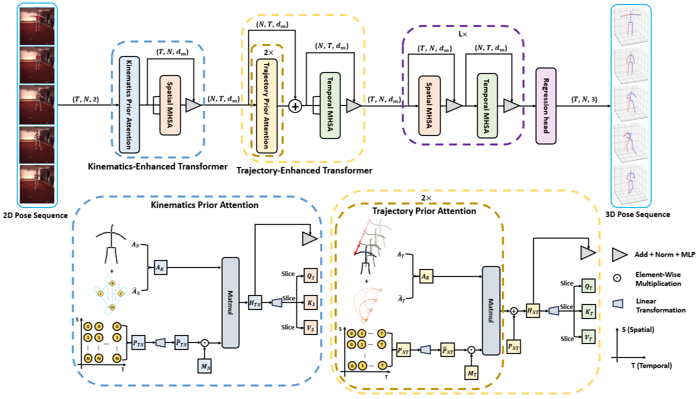

# KTPFormer: Kinematics and Trajectory Prior Knowledge-Enhanced Transformer for 3D Human Pose Estimation (CVPR2024)
This is the official implementation for "KTPFormer: Kinematics and Trajectory Prior Knowledge-Enhanced Transformer for 3D Human Pose Estimation (CVPR2024)" on PyTorch platform.

