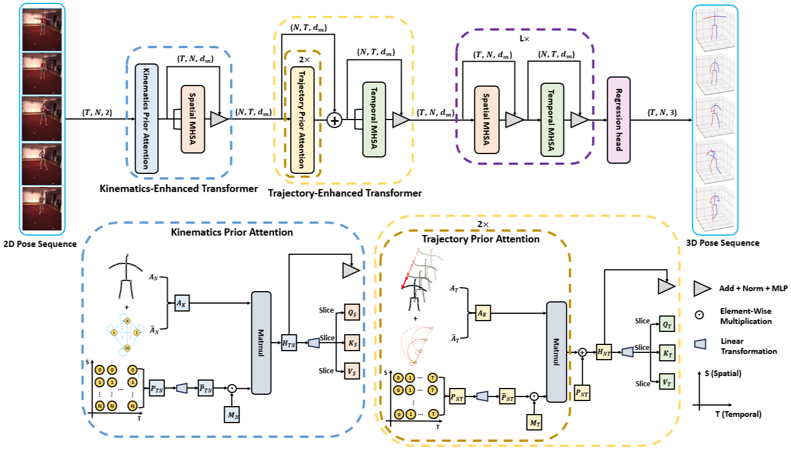

# KTPFormer: Kinematics and Trajectory Prior Knowledge-Enhanced Transformer for 3D Human Pose Estimation (CVPR2024)
This is the official implementation for "KTPFormer: Kinematics and Trajectory Prior Knowledge-Enhanced Transformer for 3D Human Pose Estimation (CVPR2024)" on PyTorch platform.


<p align="center"></p>
<p align="center"></p>


> [**KTPFormer: Kinematics and Trajectory Prior Knowledge-Enhanced Transformer for 3D Human Pose Estimation**](https://openaccess.thecvf.com/content/CVPR2024/papers/Peng_KTPFormer_Kinematics_and_Trajectory_Prior_Knowledge-Enhanced_Transformer_for_3D_Human_CVPR_2024_paper.pdf)         
> Jihua Peng, Yanghong Zhou, P. Y. Mok        
> *In IEEE Conference on Computer Vision and Pattern Recognition (CVPR), 2024*


## Dependencies

Make sure you have the following dependencies installed:

* pytorch >= 0.4.0
* matplotlib=3.1.0
* einops
* timm


## Dataset

The Human3.6M dataset and HumanEva dataset setting follow the [VideoPose3D](https://github.com/facebookresearch/VideoPose3D).
Please refer to it to set up the Human3.6M dataset (under ./data directory).

The MPI-INF-3DHP dataset setting follows the [P-STMO](https://github.com/paTRICK-swk/P-STMO).
Please refer it to set up the MPI-INF-3DHP dataset (also under ./data directory).


## Training from scratch

To train our model using the CPN's 2D keypoints as inputs under 243 frames, please run:

```bash
python run_ktpformer.py -k cpn_ft_h36m_dbb -f 243 -s 128 -l log/run -c checkpoint
```


## Evaluating

You can download our pre-trained models from [Google Drive](https://drive.google.com/drive/u/0/folders/1Dpaj3IGxFR90ubrN4TMQ8vijQ7RCReeq). Put them in the ./checkpoint directory.

To evaluate our model using the CPN's 2D keypoints as inputs under 243 frames, please run:

```bash
python run_ktpformer.py -k cpn_ft_h36m_dbb -c checkpoint --evaluate model_243_CPN_best_epoch.bin -f 243
```

To evaluate our model using the ground-truth 2D keypoints as inputs under 243 frames, please run:

```bash
python run_ktpformer.py -k gt -c checkpoint --evaluate model_243_GT_best_epoch.bin -f 243
```

## Visulization

Please refer to the [MHFormer](https://github.com/Vegetebird/MHFormer).


## Citation

If you find this repo useful, please consider citing our paper:

```
@inproceedings{peng2024ktpformer,
  title={KTPFormer: Kinematics and Trajectory Prior Knowledge-Enhanced Transformer for 3D Human Pose Estimation},
  author={Peng, Jihua and Zhou, Yanghong and Mok, PY},
  booktitle={Proceedings of the IEEE/CVF Conference on Computer Vision and Pattern Recognition},
  pages={1123--1132},
  year={2024}
}
```

## Acknowledgement
Our code refers to the following repositories.

* [VideoPose3D](https://github.com/facebookresearch/VideoPose3D)
* [P-STMO](https://github.com/paTRICK-swk/P-STMO/tree/main)
* [MHFormer](https://github.com/Vegetebird/MHFormer)
* [MixSTE](https://github.com/JinluZhang1126/MixSTE)
* [D3DP](https://github.com/paTRICK-swk/D3DP)
* [STCFormer](https://github.com/zhenhuat/STCFormer)

We thank the authors for releasing their codes.


